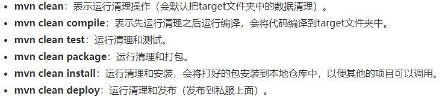
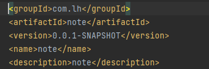
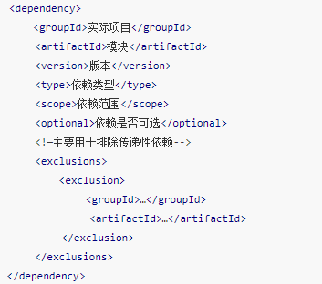
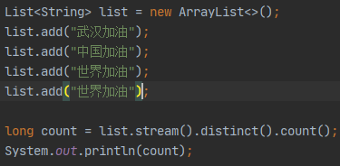
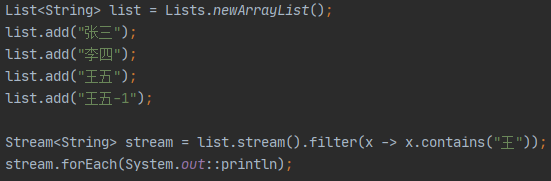
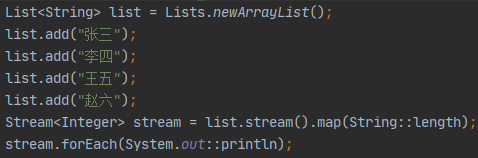
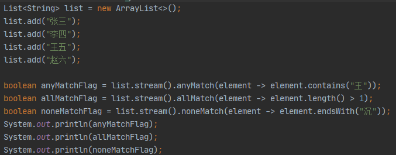

# java笔记记录

## Maven

### 1.Maven的介绍
1） 什么是Maven？Maven是一个项目管理工具,可以对项目进行自动化的构建和依赖管理
2） Maven常用命令 

### 2.Maven的使用
  
groupId 定义项目属于哪个组,可随意命名  
artifactId 定义了当前项目中唯一的ID,可随意命名  
version 指定了当前的项目版本,比如0.0.1-SHAPSHOT,SHAPSHOT意思为快照,说明当前项目还处在开发阶段
name 更友好的声明项目名称,虽然name不是必须的,但还是建议每个pom都声明一个name 

  

### 3.Maven使用注意事项
1） 父项目dependencies中所有的依赖项都会被子项目继承
2） 父项目dependencyManagement中的依赖不会被继承,子项目如果需要使用,任需要进行声明,但可以不加版本号,默认使用父项目的版本

## java异常(有待完善)

### 1.异常的介绍
异常是指程序运行时,发生了不被期望的事情,它阻止了程序按照预期的正常执行,这就是异常,异常发生时,程序会立即终止
java提供了更加优先的解决办法:异常处理机制

### 2.异常处理机制
异常处理机制能让程序在异常发生时,按照代码预先设定的异常处理逻辑,针对性的处理异常,让程序尽最大可能恢复正常并继续执行,且保持代码的清晰

### 3.异常机制所使用的关键字
* try 用于监听代码块,当try代码块内发生异常时,异常就会被抛出
* catch 用于捕获异常, catch用来捕获try代码块中发生的异常
* finally 用于回收try里所使用到的资源,比如数据库链接,读取磁盘文件等,因为finally块不管什么情况总是会执行,只有finally块执行完成之后,
才会回来执行try或者catch块中的return或者throw语句,如果finally中使用了return或者throw这些终止方法的语句,则不会跳回执行try和catch,而是直接终止
* throw 用于抛出异常
* throws 用在方法签名中,声明该方法可能抛出的异常

## Optional

### Optional描述
Optional是一个对象容器,它具有以下两个特点,提示用户要注意该对象有可能为null,第二个就是简化了if else代码

### Optional使用
创建：
1） Optional.empty(); 创建一个空的Optional实例
2） Optional.of(T t); 创建一个Optional的实例,当t为null时抛出异常
3） Optional.ofNullable(T t); 创建一个Optional实例,当t为空时不会抛出异常,而是返回一个空的实例

获取：
1） get(); 获取Optional中的对象,当Optional容器为空时会报错

判断：
1） isPresent(); 判断Optional是否为空,如果为空则返回false,否则返回true
2） orElse(T other); 如果Optional不为空,则返回Optional中的对象,如果为null,则返回 other这个默认指

## Stream

### Stream的概述
Stream就像是一个高级的迭代器,但是只能遍历一次,在流的过程钟,对流中的元素执行一些操作,比如过滤掉长度大于10的字符串,获取每个字符串的首字母
想要操作流，首先就需要有一个数据源,可以是数组或者集合,每次操作都会返回一个新的流对象,方便进行链式操作,但原有的流对象会保持不变

### Stream 流的操作类型
流的操作可以分为两种类型：
1）中间操作,可以有多个,每次返回一个新的流,可以进行链式操作
2）终端操作,只能有一个,每次执行完,这个流也就用光了,无法执行下一个操作,因此只能放在最后
  
中间操作不会立即执行,只有等到终端操作的时候,流才开始真正的遍历,用于映射,过滤等,通俗点说就是一次遍历执行了多个操作,性能就大大提升了

### Stream流的使用
1）过滤 通过filter()方法可以从流中筛选出我们想要的元素
  
filter() 方法接收的是一个Predicate(java8新增的一个函数式接口,接受一个输入参数返回一个布尔值结果)类型的参数,因此,我们可以直接将一个
Lambda表达式传递给该方法,比如说x -> x.contains(王) 就是筛选出带有王的字符串  
forEach() 方法接受的是一个Consumer(java8新增的一个函数式接口,接受一个输入参数并且无返回的操作)类型的参数, 类名:: 方法名是java8引入的新
语法,System.out 返回PrintStream类, println就是打印  
stream.forEach(System.out::println)就相当于在for循环中进行打印

2）映射 如果想通过某种操作把一个流中的元素转换成新的流中的元素,可以使用map()方法  
map() 方法接受的是一个Function(java8新增的一个函数式接口, 接受一个输入参数T, 返回一个结果R)类型的参数, 此时参数为String类的length方法
也就是把Stream<String>的流转换为一个Stream<Integer>的流
  

3）匹配 Stream提供了三个方法可以进行元素匹配 分别是
* anyMatch(), 只要有一个元素匹配传入的条件, 就返回true
* allMatch(), 只要有一个元素不匹配传入的条件, 就返回false; 如果全部匹配, 则返回true
* noneMatch(), 只要有一个元素匹配传入的条件, 就返回false; 如果全部匹配, 则返回true

4）组合 reduce()方法的主要作用是把Stream中的元素组合起来, 它有两种用法
* Optional<T> reduce(BinaryOperator<T> accumulator) 没有起始值,只有一个参数,就是运算规则,此时返回Optional  
* T reduce(T identity, BinaryOperator<T> accumulator) 有起始值,有运算规则,
