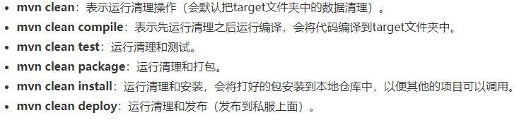
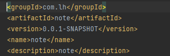
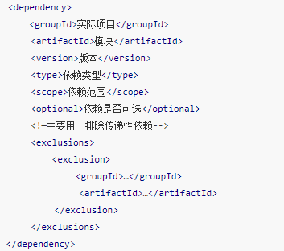

# java笔记记录

## Maven

### 1.Maven的介绍
* 什么是Maven？Maven是一个项目管理工具,可以对项目进行自动化的构建和依赖管理
* Maven常用命令 


### 2.Maven的使用
 <br/>
groupId 定义项目属于哪个组,可随意命名 <br/>
artifactId 定义了当前项目中唯一的ID,可随意命名 <br/>
version 指定了当前的项目版本,比如0.0.1-SHAPSHOT,SHAPSHOT意思为快照,说明当前项目还处在开发阶段
name 更友好的声明项目名称,虽然name不是必须的,但还是建议每个pom都声明一个name 

 <br/>

### 3.Maven使用注意事项
* 父项目dependencies中所有的依赖项都会被子项目继承
* 父项目dependencyManagement中的依赖不会被继承,子项目如果需要使用,任需要进行声明,但可以不加版本号,默认使用父项目的版本

## java异常(有待完善)

### 1.异常的介绍
异常是指程序运行时,发生了不被期望的事情,它阻止了程序按照预期的正常执行,这就是异常,异常发生时,程序会立即终止
java提供了更加优先的解决办法:异常处理机制

### 2.异常处理机制
异常处理机制能让程序在异常发生时,按照代码预先设定的异常处理逻辑,针对性的处理异常,让程序尽最大可能恢复正常并继续执行,且保持代码的清晰

### 3.异常机制所使用的关键字
* try 用于监听代码块,当try代码块内发生异常时,异常就会被抛出
* catch 用于捕获异常, catch用来捕获try代码块中发生的异常
* finally 用于回收try里所使用到的资源,比如数据库链接,读取磁盘文件等,因为finally块不管什么情况总是会执行,只有finally块执行完成之后,
才会回来执行try或者catch块中的return或者throw语句,如果finally中使用了return或者throw这些终止方法的语句,则不会跳回执行try和catch,而是直接终止
* throw 用于抛出异常
* throws 用在方法签名中,声明该方法可能抛出的异常

## Stream

### Stream的概述
Stream是java8中处理集合的关键抽象概念,它可以指定你希望对集合进行的操作,可以执行复杂的查询,过滤和映射数据等操作,使用Stream API对集合数据进行操作,就类似使用
SQL执行的数据库操作，简答来说，Stream API提供了一种高效且易于使用的处理数据的方式,对流的操作分为两种，1.中间操作,每次返回一个新的流，可以有多个,2.终端操作,每个
流只能进行一个词终端操作，操作结束后无法再次使用，终端操作会产生一个新得集合或值

### Stream的特点
* 1.Stream不是数据结构,不会保存数据
* 2.不会修改原来的数据源,它会将操作后的数据保存到另一个对象中,但是peek方法可以修改流中的元素
* 3.惰性求值,流在处理过程中,只是对操作进行了记录,并不会立即执行,需要等到执行终止操作的时候才会实际的计算

### Stream的分类
* 1.无状态：指元素的处理不受之前元素的影响
* 2.有状态：指该操作只有拿到所有元素之后才能继续下去
* 3.非短路操作：指必须处理所有元素才能得到最终结果
* 4.短路操作：指遇到某些符合条件的元素就可以得到最终结果

### Stream和ParallelStream的区别
Stream是顺序流,由主线程按顺序对流执行操作,而ParallelStream是并行流,内部已多线程并行执行的方式对流进行操作,但前提是流中的数据处理没有顺序要求
除了直接创建并行流,耶可以通过paraller()把顺序流转换为并行流

### Stream的使用
* 1.遍历/匹配
````
	List<Integer> list = Lists.newArrayList(7, 6, 9, 3, 8, 2, 1);
	//遍历元素
	list.stream().forEach(System.out::println);
	//匹配第一个元素
	Optional<Integer> findFirst = list.stream().findFirst();
````

* 2.筛选
````
	//筛选出Integer集合中大于7的元素，并输出
	List<Integer> list = Arrays.asList(6, 7, 3, 8, 1, 2, 9);
	list.stream().filter(x -> x > 7).forEach(System.out::println);

	//筛选员工中工资高于8000的人，并输出
	List<Person> personList = Lists.newArrayList();
	personList.add(new Person("Tom", 8900, 23, "male", "New York"));
	personList.add(new Person("Jack", 7000, 25, "male", "Washington"));
	personList.add(new Person("Lily", 7800, 21, "female", "Washington"));
	personList.add(new Person("Anni", 8200, 24, "female", "New York"));
	personList.add(new Person("Owen", 9500, 25, "male", "New York"));
	personList.add(new Person("Alisa", 7900, 26, "female", "New York"));
	personList.stream().filter(x -> x.getSalary() > 8000).forEach(System.out::println);
````

* 3.聚合
````
	//获取String集合中最长的元素。
	List<String> list = Arrays.asList("admin", "test", "zico", "kevin", "Leo");
	String string = list.stream().max(Comparator.comparing(String::length)).get();
	
	//获取获取integer集合中的最大值
	List<Integer> intList = Arrays.asList(7, 6, 9, 4, 11, 6);
	Integer integer = intList.stream().max(Integer::compareTo).get();
	
	//通过max获取工资最高的员工
	List<Person> personList = Lists.newArrayList();
	personList.add(new Person("Tom", 8900, 23, "male", "New York"));
	personList.add(new Person("Jack", 7000, 25, "male", "Washington"));
	personList.add(new Person("Lily", 7800, 21, "female", "Washington"));
	personList.add(new Person("Anni", 8200, 24, "female", "New York"));
	personList.add(new Person("Owen", 9500, 25, "male", "New York"));
	personList.add(new Person("Alisa", 7900, 26, "female", "New York"));
	personList.stream().max(Comparator.comparing(Person::getSalary)).get();

	//计算集合的元素个数
	long count = intList.stream().count();
````

